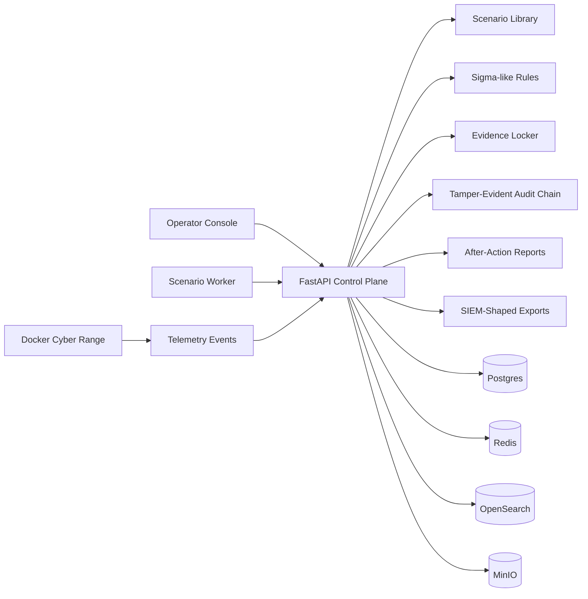

<p align="center">
  
</p>

<p align="center">
  <a href="https://github.com/SarthakShrivastav-a/breach-sim-platform/actions/workflows/ci.yml"></a>
  <a href="https://github.com/SarthakShrivastav-a/breach-sim-platform/releases/tag/v0.1.0-enterprise-alpha"></a>
  
  
  
</p>

<p align="center">
  <b>An isolated enterprise cyber range for safe breach simulation, telemetry generation, detection validation, evidence tracking, and after-action reporting.</b>
</p>

<p align="center">
  <a href="#quick-start"><b>Quick Start</b></a>
  ·
  <a href="#what-you-get"><b>What You Get</b></a>
  ·
  <a href="#architecture"><b>Architecture</b></a>
  ·
  <a href="docs/index.html"><b>Animated Showcase</b></a>
  ·
  <a href="#release-workflow"><b>Release Workflow</b></a>
</p>

---

## Why This Exists

Security teams often know they own SIEM rules, SOAR playbooks, response procedures, and compliance obligations. What they rarely have is a safe, repeatable environment to prove those moving parts actually work under realistic exercise conditions.

**Breach Simulation Platform** gives teams a local-first cyber range where scenarios create controlled telemetry, detections are validated deterministically, evidence is hashed, and reports are generated for technical review and audit readiness.

> This project is for authorized simulation and training only. It does not target production systems and defaults to telemetry-only execution.

## What You Get

<table>
  <tr>
    <td width="50%">
      <h3>Control Plane</h3>
      <ul>
        <li>FastAPI backend with scenario, exercise, telemetry, detection, evidence, audit, report, and SIEM-export endpoints.</li>
        <li>Config-first runtime via <code>config/app.yaml</code>.</li>
        <li>RBAC foundation for Admin, Exercise Director, Red Team Operator, Blue Team Analyst, Auditor, and Viewer.</li>
      </ul>
    </td>
    <td width="50%">
      <h3>Cyber Range</h3>
      <ul>
        <li>Docker Compose lab with backend, frontend, worker, Postgres, Redis, OpenSearch, MinIO, attacker, and victim services.</li>
        <li>Safe scenario execution with lab-target and command allowlists.</li>
        <li>MITRE ATT&CK v19.0 metadata baked into scenario definitions.</li>
      </ul>
    </td>
  </tr>
  <tr>
    <td width="50%">
      <h3>Detection Engineering</h3>
      <ul>
        <li>Sigma-like detection rule loading.</li>
        <li>Deterministic correlation from simulated telemetry.</li>
        <li>Splunk HEC, QRadar LEEF, and Microsoft Sentinel-shaped exports.</li>
      </ul>
    </td>
    <td width="50%">
      <h3>Evidence And Reporting</h3>
      <ul>
        <li>SHA-256 evidence artifact metadata.</li>
        <li>Tamper-evident audit hash chaining.</li>
        <li>After-action reports with coverage and recommendations.</li>
      </ul>
    </td>
  </tr>
</table>

## Animated Showcase

GitHub READMEs do not allow custom CSS or JavaScript, so the full animated experience lives in a real HTML page:

```text
docs/index.html
```

Open it locally in a browser, or publish `docs/` with GitHub Pages for a live project showcase.

## Quick Start

### Local Python And Frontend Checks

```powershell
python -m venv .venv
.venv\Scripts\Activate.ps1
pip install -r backend\requirements.txt -r worker\requirements.txt
pytest backend\tests worker\tests

cd frontend
npm install
npm run lint
npm test
npm run build
```

### Run The API

```powershell
uvicorn app.main:app --app-dir backend --reload
```

API docs:

```text
http://localhost:8000/docs
```

### Run The Operator Console

```powershell
cd frontend
npm run dev
```

Console:

```text
http://localhost:5173
```

### Run The Full Range

```powershell
docker compose up --build
```

Local services:

| Service | URL |
| --- | --- |
| API | `http://localhost:8000` |
| API docs | `http://localhost:8000/docs` |
| Frontend | `http://localhost:5173` |
| OpenSearch | `http://localhost:9200` |
| MinIO Console | `http://localhost:9001` |

## Architecture



## Safety Model

The alpha defaults are intentionally defensive:

- Telemetry-only execution is the default mode.
- Commands must be explicitly allowlisted in `config/app.yaml`.
- Targets must match configured lab hosts or CIDRs.
- Unsafe command patterns are blocked before execution.
- External SIEM/SOAR pushes are disabled unless configured.
- Secrets and environment-specific values are referenced through config and environment variables.

## Repository Layout

```text
backend/      FastAPI control plane, scenario engine, detection, evidence, audit, tests
frontend/     React/Vite operator console
worker/       Scenario execution worker CLI
config/       Runtime configuration
scenarios/    YAML scenario definitions
rules/        Detection rules
docs/         Architecture, release docs, animated HTML showcase
```

## Verification

The release workflow verifies:

```powershell
pytest backend\tests worker\tests
python -m ruff check backend worker
cd frontend
npm run lint
npm test
npm run build
docker compose config --quiet
docker build -f backend\Dockerfile -t breach-sim-backend:test .
docker build -f frontend\Dockerfile -t breach-sim-frontend:test .
docker build -f worker\Dockerfile -t breach-sim-worker:test .
```

## Release Workflow

This repository follows the established GitHub release workflow:

- `main`: release branch.
- `dev`: integration branch.
- `feature/*`, `fix/*`, `test/*`, `docs/*`, `ci/*`: short-lived PR branches.
- Pull requests merge into `dev`.
- Release PRs merge `dev` into `main`.
- Docker Hub publish workflow exists but is gated until `ENABLE_DOCKER_PUBLISH=true`, `docker.image_repository` is configured, and Docker Hub secrets are available.

## Current Release

```text
v0.1.0-enterprise-alpha
```

<p align="center">
  <a href="https://github.com/SarthakShrivastav-a/breach-sim-platform/releases/tag/v0.1.0-enterprise-alpha"><b>View Release</b></a>
  ·
  <a href="docs/architecture.md"><b>Architecture Notes</b></a>
  ·
  <a href="docs/release.md"><b>Release Process</b></a>
</p>

